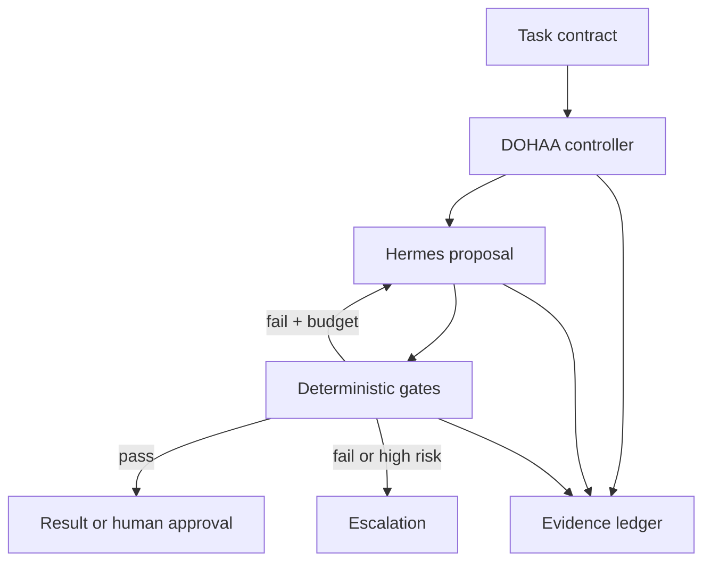

# Hermes-DOHAA

Hermes-DOHAA is an evidence-gated governance and bounded self-improvement layer for [Hermes Agent](https://github.com/NousResearch/hermes-agent). It is the reference implementation of **DOHAA — Deterministically Orchestrated Hybrid Agentic Architecture**.

> **Status:** pre-alpha research prototype. It is not yet a production authorization system.

## Where DOHAA comes from

**DOHAA** stands for **Deterministically Orchestrated Hybrid Agentic Architecture**. It is the English formulation of **AAHOD - Arquitectura Agéntica Híbrida con Orquestación Determinista**, a vendor-independent architectural pattern proposed and formalized by Dante Guillermo Ribulotta.

The architecture is described in the following paper:

> Dante Guillermo Ribulotta. *Arquitectura Agéntica Híbrida con Orquestación Determinista (AAHOD): un patrón para sistemas de inteligencia artificial confiables, auditables y de calidad estable.* Preprint v1.0, July 27, 2026. [https://doi.org/10.5281/zenodo.21628049](https://doi.org/10.5281/zenodo.21628049)

AAHOD/DOHAA emerged from operational constraints involving inference budgets, latency, queues, continuity, validation, and traceability. It generalizes an earlier public tri-layer architecture into an explicit distribution of authority across control, cognition, assurance, evidence, and action.

Hermes-DOHAA is **not the architecture itself and DOHAA is not a Hermes feature**. This repository is an open-source reference implementation that applies part of the architecture to Hermes Agent. The paper is a non-peer-reviewed preprint and defines an empirical validation protocol; neither the paper nor this repository should be read as proof that DOHAA is already superior to alternative architectures.

See [Origin and theoretical foundations](docs/origin-and-foundations.md) for the complete provenance, formal definition, implementation mapping, and scientific status.

## Why this project exists

LLM agents are effective at proposing plans, diagnosing failures, and generating candidate repairs. They are not a reliable authority for deciding whether their own work is correct or safe. Hermes-DOHAA therefore treats every model output as an **untrusted proposal** and keeps acceptance, retry, escalation, and durable evidence under deterministic program control.

The project complements Hermes rather than forking it:

- **Hermes Agent** provides the cognitive runtime, tools, sessions, and model portability.
- **DOHAA** owns the task contract, bounded control loop, assurance gates, evidence ledger, human approval boundaries, and promotion of learned changes.
- **Hermes Agent Self-Evolution** can later generate candidates, but cannot promote them without regression evidence and policy approval.

## First vertical slice

The `v0.1` bootstrap implements:

- a strict, versioned task contract;
- a bounded controller state machine;
- a Hermes adapter over its OpenAI-compatible API server;
- deterministic action-policy and evidence-reference gates;
- a tamper-evident SQLite event ledger;
- retry, no-progress termination, and human escalation;
- a standard-library-only runtime with unit and integration tests.



## Install and test

```bash
python -m venv .venv
source .venv/bin/activate
python -m pip install -e .
python -m unittest discover -s tests -v
```

Validate an example contract:

```bash
hermes-dohaa validate examples/task_contract.json
```

Run against a configured Hermes API server:

```bash
export HERMES_API_KEY="..."  # optional if the local server has no bearer key
hermes-dohaa run examples/task_contract.json \
  --hermes-url http://127.0.0.1:8642 \
  --ledger .dohaa/evidence.sqlite3
```

The proposal phase must use a restricted Hermes profile and a sandbox. A prompt instruction is not a security boundary.

## Deployment and operations

The repository includes documentation and sanitized reference templates for
running the cognitive runtime in a separate, restricted trust domain:

- [Isolated deployment guide](docs/deployment.md)
- [Operations runbook](docs/operations.md)
- [Governed learning loop](docs/learning-loop.md)
- [Runtime environment example](deploy/env/runtime.env.example)
- [Hardened systemd service example](deploy/systemd/hermes-runtime.service.example)
- [Network-isolation nftables example](deploy/nftables/runtime-isolation.nft.example)

The templates use RFC 5737 documentation addresses and contain no production
credentials. They must be adapted and independently verified before use.

## Architectural invariants

1. Model output is a proposal, never proof.
2. Only deterministic code changes controller state.
3. Attempts, time, and actions are budgeted.
4. Every final claim must point to evidence.
5. Irreversible or high-risk actions require an explicit approval gate.
6. Durable state lives outside model context.
7. Failure reduces capability rather than integrity.
8. Learned changes move through quarantine, evaluation, shadow use, promotion, and rollback.

See [Origin and theoretical foundations](docs/origin-and-foundations.md), [Architecture](docs/architecture.md), [Threat model](docs/threat-model.md), and [ADR-0001](docs/adr/0001-independent-control-plane.md).

## Roadmap

- **v0.1 — Control and evidence:** contracts, bounded state machine, Hermes adapter, deterministic gates, evidence ledger.
- **v0.2 — Autonomous repair:** failure classification, regression-test generation, no-progress detection, resumable runs.
- **v0.3 — Governed learning:** candidate quarantine, shadow evaluation, holdouts, promotion and rollback.
- **v1.0 — Empirical validation:** compare baseline Hermes, unconstrained reflection, and Hermes-DOHAA across at least two domains.

## Naming and licensing

- Display name: **Hermes-DOHAA**
- Repository/package/CLI: `hermes-dohaa`
- Python import: `hermes_dohaa`

Code is licensed under Apache-2.0. Documentation and diagrams are licensed under CC BY 4.0; see [LICENSE-DOCS.md](LICENSE-DOCS.md). Hermes Agent is an independent MIT-licensed project by Nous Research and is not redistributed here.

Hermes-DOHAA is an independent project and is not affiliated with or endorsed by Nous Research.
