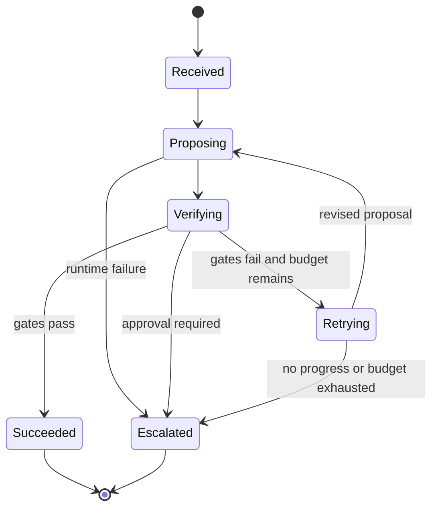
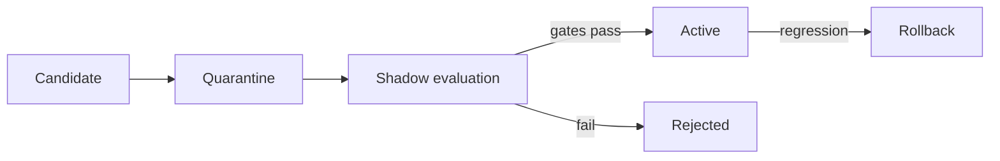

# Architecture

This document describes the initial implementation boundary. The academic architecture is broader than this pre-alpha codebase.

## Mapping to DOHAA

| DOHAA component | v0.1 implementation | Authority |
|---|---|---|
| Orchestrator | `DohaaController` | Changes run state; owns retry and escalation |
| Perception | Contract inputs and runtime evidence | Supplies observations; cannot approve itself |
| Filter | Contract validation and explicit constraints | Rejects malformed work before execution |
| Generative subsystem | `AgentRuntime`, initially Hermes API | Produces untrusted proposals |
| Validators | Assurance `Gate` implementations | Return deterministic pass/fail results |
| Memory | SQLite evidence ledger | Persists events outside model context |
| Actuators | Deliberately absent in v0.1 | Planned behind capability and approval gates |
| Human | `requires_human_approval` boundary | Authorizes high-impact progression |

## Four planes

1. **Control:** contract, state machine, budgets, retry and escalation.
2. **Cognitive:** Hermes and any future specialized models.
3. **Assurance:** deterministic gates and domain-specific validators.
4. **Evidence:** append-only event ledger, hashes, artifacts and provenance.

## Runtime state machine

`FAILED` is reserved for deterministic controller faults. Expected model, tool, policy, and budget failures escalate with evidence rather than crashing the control plane.

## Hermes integration decision

Hermes currently documents ACP, TUI Gateway JSON-RPC, and an HTTP/SSE API server. The bootstrap uses the OpenAI-compatible `/v1/chat/completions` endpoint to keep the adapter dependency-free and easy to smoke-test. A later adapter should use TUI Gateway JSON-RPC when DOHAA needs fine-grained approval, interrupt, streaming tool-event, session-branching, or subagent controls.

The Hermes process must run under a restricted profile and an actual sandbox. A system prompt that asks Hermes not to mutate state is advisory and is not accepted as a security control.

## Evolution lifecycle

Learned changes are not written directly into active prompts, policies, skills, or code:

The optimizer may see training and validation cases. It must not read protected holdouts or modify the verifiers that decide promotion.
