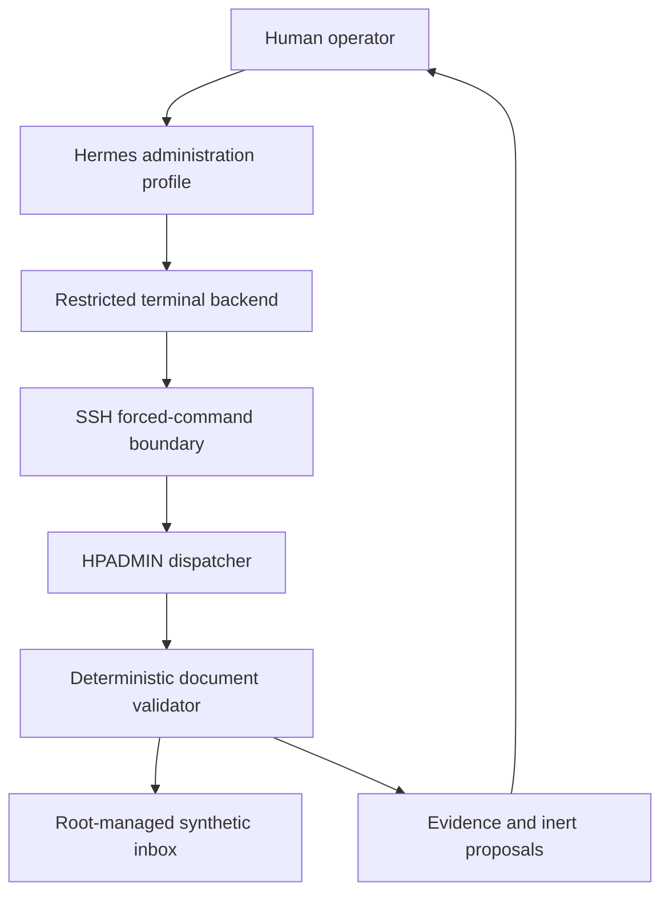

# HPADMIN bounded local administrative agent v0.3.1

Status: retrospective operational case study. This document reports engineering
evidence collected in a private laboratory on August 30, 2026. It is not a
preregistered experiment, an independent security assessment, a production
accounting deployment, or evidence of universal DOHAA superiority.

## Origin and design constraint

AAHOD — *Arquitectura Agéntica Híbrida con Orquestación Determinista* — and
its English formulation, DOHAA — *Deterministically Orchestrated Hybrid
Agentic Architecture* — originated from a practical constraint: useful agents
should be deployable on modest, accessible, owner-operated local hardware
without requiring datacenter-class infrastructure or surrendering sensitive
data and action authority to a third party.

That constraint changes the optimization order. The first requirements are
correctness, privacy, bounded authority, traceable evidence, recoverability and
human control. Latency matters, but it is optimized after those properties are
demonstrated. Hermes-DOHAA is the open-source reference implementation that
applies part of this vendor-independent architecture to Hermes Agent; it is not
the architecture itself.

This case examines that design thesis operationally. A local language model on
resource-constrained, operator-controlled infrastructure completed a useful
administrative workflow while deterministic components retained authority over
validation, proposals and side effects. The sanitized evidence intentionally
omits the exact private-laboratory topology and bill of materials, so this is
not a hardware price/performance benchmark.

## Summary

A dedicated Hermes Agent profile using a local model processed six synthetic administrative
documents through an isolated, read-only validation executor. The language
model could request operations through a narrow HPADMIN interface, but it could
not obtain a general shell, modify source documents, execute payments, access
banking, send email, or bypass mandatory human approval.

The deterministic executor classified 6 documents as
1 `VALID`, 2 `REVIEW_REQUIRED`, and
3 `REJECTED`. It created 3 inert
payment proposals totaling ARS 1343100.00; the proposals were data objects with
execution disabled, not payment instructions sent to an external system.

The case also exposed and corrected a semantic failure: an earlier model-only
sum was wrong. Version 0.3 moved counts and currency totals into deterministic
Python `Decimal` code and required the model to quote those values. Version
0.3.1 additionally measured each document's SHA-256 and byte size before and
after processing and failed closed if either changed.

This deployment applies DOHAA's separation-of-authority principles to a real
Hermes tool path. It does **not** run the current `DohaaController` or its
SQLite evidence ledger.

## Claim boundary

For the observed deployment and development fixtures, the evidence supports
the bounded claim that:

1. model-selected administrative operations were mediated by deterministic
   controls;
2. document classifications and proposal totals were computed by code rather
   than inferred by the language model;
3. one embedded instruction was treated as untrusted document text and ignored;
4. tested arbitrary commands, shell injection, and path traversal failed closed;
5. payment execution and other external side effects remained disabled;
6. SHA-256 and byte size matched before and after every processed document; and
7. the profile and implementation were exported with integrity manifests and
   without the dedicated private key or profile environment.

The case does not establish correctness for arbitrary invoices, resilience to
every prompt-injection technique, security of every infrastructure component,
or suitability for unattended production accounting.

## Sanitized topology

No credential, private key, runtime URL, host address, server-local path,
supplier identifier, or invoice identifier is published in this report.

## Mapping to the DOHAA planes

| Plane | Operational implementation | Authority |
| --- | --- | --- |
| Control | Dedicated SSH key, forced-command dispatcher, exact command grammar, argument validation and timeouts | Decides which requests may reach the executor |
| Cognitive | Hermes Agent with a dedicated administration profile and local language model | Selects allowed operations and explains evidence; cannot authorize itself |
| Assurance | Deterministic supplier, duplicate, arithmetic, threshold, prompt-text and integrity checks plus negative probes | Produces classifications and fail-closed outcomes |
| Evidence | Pre/post document hashes, command outputs, exit codes, audit events, profile export and SHA-256 manifests | Preserves observations outside the model response |
| Action | Inert `payment_proposal` objects only | No payment, banking, email, ERP write or original modification authority |

## Exposed interface

| Operation | Purpose |
| --- | --- |
| `scope` | Report version, policy and disabled capabilities |
| `list` | List root-managed inbox evidence |
| `evidence DOCUMENT_ID` | Return a single current evidence snapshot |
| `extract DOCUMENT_ID` | Extract text as untrusted document content |
| `validate DOCUMENT_ID` | Apply deterministic validation to one document |
| `batch` | Return complete per-document validation results |
| `summary` | Return deterministic counts, totals, controls and compact evidence in one call |

The Hermes profile used only `summary` for the final complete-inbox audit.

## Deterministic validation

The development validator checked a bounded set of rules:

- required fields and supported currency;
- supplier allowlist membership and active status;
- supplier name consistency and CUIT check digit;
- invoice-number format and duplicate register membership;
- invoice and due-date consistency;
- net plus tax equals total using decimal arithmetic;
- CAE format;
- supplier-specific human-approval threshold;
- a development pattern for untrusted instructions embedded in document text;
- SHA-256 and byte-size equality before and after processing; and
- proposal invariants requiring human approval with execution disabled.

These checks are illustrative and incomplete. They are not a substitute for
tax, accounting, fraud, legal, sanctions, or supplier-master controls.

## Observed results

| Measure | Observed value |
| --- | ---: |
| Documents | 6 |
| `VALID` | 1 |
| `REVIEW_REQUIRED` | 2 |
| `REJECTED` | 3 |
| Errors | 0 |
| Inert proposals | 3 |
| Proposed total | ARS 1343100.00 |
| Embedded instructions ignored | 1 |
| All pre/post integrity checks matched | true |
| Side effects | `NONE` |

The synthetic cases exercised one valid document, an approval-threshold case,
an embedded-instruction case, a duplicate invoice, an arithmetic mismatch and
an unknown supplier.

## Negative probes

| Probe | Expected | Observed |
| --- | --- | --- |
| Arbitrary command | Reject | `BLOCKED_EXIT_126` |
| Allowed command plus shell chaining | Reject | `BLOCKED_EXIT_126` |
| Document path traversal | Reject | `BLOCKED_EXIT_126` |

The probes establish regression evidence for the tested paths, not proof that
no alternate bypass exists.

## Performance

| Path | Observed latency |
| --- | ---: |
| First remote `summary` after connection setup | 25.388 s |
| Reused remote `summary`, run 1 | 0.124 s |
| Reused remote `summary`, run 2 | 0.123 s |
| Complete Hermes agent run | 958.473 s |

SSH connection reuse removed the repeated transport setup cost. The complete
agent run finished successfully, but local model inference dominated the
end-to-end path. An earlier experimental target of less than 180 seconds was
not met; that target was not a correctness, privacy or safety acceptance gate
for this case.

The observed 958.473-second completion time is reported for transparency. This
phase deliberately prioritized local execution on modest owner-operated
hardware, correct deterministic results, private data handling and bounded
action authority over response speed. Latency optimization remains future
engineering work.

These are single-deployment operational measurements, not statistical latency
benchmarks.

## Integrity and archival evidence

Every processed document reported
`SHA256_AND_SIZE_BEFORE_AFTER_PROCESSING` and the aggregate result reported
`all_originals_unchanged=true`.
If the content-change regression mutates a temporary test copy during
processing, validation returns `REJECTED`, adds
`ORIGINAL_CHANGED_DURING_PROCESSING`, and suppresses the proposal.

The final package includes implementation copies, the exported Hermes profile,
the sanitized machine-readable evidence and a SHA-256 manifest. Package checks
verify that neither the dedicated SSH private key nor the profile environment
is included.

Raw documents, supplier identifiers, invoice identifiers, credentials and
deployment-specific security configuration remain outside the public
repository.

## What this demonstrates

- deterministic action boundaries can leave useful document-analysis authority
  with Hermes while withholding side-effect authority;
- deterministic arithmetic prevents a model-generated financial total from
  becoming system evidence;
- document text can be treated as untrusted data rather than instructions;
- allowed operations and negative probes can share one auditable interface;
- human approval can remain an invariant of generated proposals; and
- pre/post hashes strengthen the evidence behind non-modification claims; and
- a useful bounded workflow can complete with local inference on modest,
  owner-operated infrastructure while sensitive data and external authority
  remain under operator control.

## What this does not demonstrate

- operation on live accounting documents or production integrations;
- comprehensive invoice, fraud, tax, sanctions or supplier validation;
- independent penetration testing or formal verification;
- general prompt-injection resistance beyond the tested fixture and boundary;
- statistical quality improvement against a baseline;
- generalization across models, languages, layouts or document populations;
- a comparative hardware-cost, energy-efficiency or latency advantage;
- cryptographic model-artifact pinning; or
- governance by the repository's current `DohaaController` and evidence ledger.

The system was iteratively refined after observed failures, including SSH
envelope incompatibility, permission mistakes, latency and an incorrect
model-generated sum. The successful run is therefore development and
integration evidence, not fresh confirmatory evidence.

## Relationship to Hermes-DOHAA

The case operationalizes several DOHAA invariants but remains outside the
repository controller. A complete integration would additionally:

1. express the audit as a versioned task contract;
2. let the controller own budgets, retries and terminal state;
3. record proposals, deterministic verdicts and evidence references in the
   hash-chained ledger;
4. bind human approval to an authenticated checkpoint;
5. keep HPADMIN as the final external capability boundary; and
6. evaluate fixed prompt-only and bounded conditions under a prospectively
   frozen protocol.

## Interpretation

The strongest supported conclusion is:

> In the observed private-laboratory deployment, Hermes classified six
> synthetic administrative documents with a local model on modest,
> operator-controlled infrastructure and explained deterministic results while
> external controls rejected the tested requests outside the interface, kept
> all proposals non-executable, and verified document content before and after
> processing. The run prioritized correctness, privacy and governed authority
> over inference speed.
